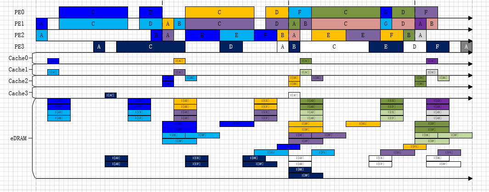

# 应用模型

随着计算效率在由神经驱动的学习系统（neuro-inspired learning systems）中被施以强烈的关注，基于神经形态（neuromorphic）的高级加速架构越来越多，其中最经典的就是基于HMC的Neurocube。HMC由多个堆叠在一起的DRAM Die和一个单独的逻辑层组成。如图左侧，每个DRAM Die被划分成16份子块，从垂直方向看对应的子块构成一个Vault，每个Vault在逻辑层上对应一个Vault控制器。Neurocube在HMC的基础上对逻辑层进行了改变，将Vault控制器、可编程的神经序列生成器（PNG）、路由器（Router）、执行单元（PE）组合在一起，构成新的逻辑层。如图右侧，路由器通过2D全连接NoC网络连接在一起；每个执行单元内包括了一个Cache、一个权值Buffer、一个缓冲Buffer、一个操作计数器和多个乘法累加器。

数据可以被存储Vault（DRAM）和Cache之中。DRAM能够存储的数据远大于Cache，但读取的速度却慢了很多，所以**在存储数据的时候需要判断是存储在Vault之中还是存储在Cache之中**。PNG负责控制数据的流动，当计算开始时，PNG根据当前神经元所需要的数据去对应的存储位置取到数据，然后封装成对应的数据包，通过NoC网络传送给对应的PE进行计算。当PE中MAC计算完成后，将计算完成的结果传回给PNG，PNG判断后继需要这个数据的神经元，将其存储到对应PE的Cache之中，若Cache存储不下，则存储到对应的vault中。

# 样例

通过对CNN中不同网络的运行时间的观察，可以发现这些网络中不同的节点运行时间相差很大，但是这些网络都有一个典型的共性：在这些网络中有一部分节点的运行时间远远大于其他节点的运行时间，它们的运行时间占据了主导的地位。这些节点可以被称为关键节点。

从数据分析图中可以看出，关键节点的运行时间占据总运行时间的*30%-40%*。如果按照常见的排列方案，可以明显的发现当关键节点在运行时，其他PE几乎处于空闲状态，导致了极低的利用率。为了能够高效的利用在关键节点运行时其他PE空闲的时间， 本文中的算法利用重定时的技术把其他周期的节点安排在空闲时间内，并优先排列关键节点。下图展示了一个CNN网络图抽象建模成的有向无环图。

如上图展示了CNN网络图在4个$PE$上的一种调度。因为该DAG的最大并发度为3，所以执行该DAG的一个周期需要3个$PE$，即分别是$PE_0,PE_1,PE_2$，称之为*正常排列*；剩下一个$PE_3$，为了不让其闲置，可以将DAG压缩在一个$PE$上运行，称之为*压缩排列*。虽然压缩排列中一个周期的时间会长于正常排列中的一个周期时间，但可以保证压缩排列的时间不决定总时间的前提下安排少量次数的图，利用剩余的少量$PE$，按照压缩排列的思想排列。接下来的周期遵循相同的排列模式，前三个$PE$保持正常排列，最后一个$PE$保持压缩排列。因为每个$PE$上的Cache的容量有限，所以在正常排列的每个周期内只有$I_{AB},I_{AC},I_{AD},I_{BE},I_{CE},I_{CF},I_{EG}$可以被分配到各个$PE$ 上的Cache中，而剩下$I_{BF},I_{DE},I_{DF},I_{FG}$将被分配到eDRAM中。虽然正常排列的时间比较短，但是可以发现在一个周期内，$PE$的利用率十分的低，节点$C$的运行时间远远大于同一拓扑序的节点$B,D$，当节点$B,D$运行完成后，由于节点$C$还在运行，所以节点$B,D$所在的$PE_0$和$PE_2$进入空闲状态。

为了能够尽可能利用所有的计算资源，尤其是利用在DAG中关键节点运行时，其他空闲$PE$的计算资源。通过对原来DAG中的节点位置进行重新排列，构成新的周期，再利用重定时技术，加快运行速度，并提高了利用率。

上图展示了同样的CNN网络图再4个$PE$上的一种新的调度策略。同样还是依据DAG的最大并发度将$PE$分为两堆，$PE_0,PE_1,PE_2$组成*正常排列*，$PE_3$组成*压缩排列*。这个调度策略优先考虑关键节点的位置摆放，尽量避免了关键节点堆积在同一个$PE$上，同时在关键节点运行时，可以将其他轮次的节点安排在当前轮次关键节点运行时的其他空闲$PE$上。上图中关键节点是节点$C$，第二个周期中，第三轮和第四轮的节点$C$，分别在$PE_0$和$PE_1$上运行，在它们在运行的同时，第一轮和第二轮的节点$E$在$PE_3$上同时运行。通过3个周期后，可以发现一个周期内的所有初始排列都在某一个轮次中运行，使得$PE$的利用率达到了最大值：$(16\times 2)/(11\times 3)=97\%$。压缩排列与正常排列一样，也在已有的$PE$数目上尽量满足关键节点优先考虑的特性，同时也需要满足不影响总时间的前提下安排少量次数的图。对于节点$i$和节点$j$之间传输的数据$I_{ij}$，需要根据当前的$PE$上Cache的分布状况利用动态规划的思想来选择放入Cache，还是放入eDRAM。需要注意的是，虽然有时候$PE$上的Cache能够放下$I_{ij}$，但由于重新排列的缘故，等待的时间已经超过了放入eDRAM所消耗的时间，那么此时则$I_{ij}$放入eDRAM中，为后续留出Cache空间。

# 算法

## 输入

**定义：**有向无环图DAG，$G=(V,E,P,R)$，其中$V$表示节点集合，节点个数是$N_V$；$E$表示边集合，边个数是$N_E$；$P$表示PE个数；$R$表示图$G$的重定时次数。

**定义：**$I$表示图$G$需要循环的次数。

## 输出

* 图$G$循环$I$次所需要的总时间$T$ 

## 过程

### Step One：计算每次发射所需要的核数和图循环次数

考虑到图最大的并发度是有限的，所以可以结合多发射的思想，合理的利用PE，限定每次发射（*Launch*）需要的PE个数，并将总的循环次数均摊到每次发射之上，以达到更高效的并行性。

**定义：**图的最大并发度是$m$，$H=\lceil P/m\rceil$。

那么图共需要$H$次发射。

若$m$整除$P$，

* 每次发射均需要的核数是$m$。
* 每次发射最多需要$I_{max}=\lceil I/H\rceil$次循环。

若$m$不整除$P$，

* 前$H-1$次发射的核数是$m$，最后一次发射核数是$P\%m$。
* 若前$H-1$次发射每次循环$I_{H-1}$次，最后一次发射循环$I_{last}$次。故$(I_{H-1},I_{last})$需要满足$I=(H-1)\times I_{H-1}+I_{last}$。对所有满足的$(I_{H-1}, I_{last})$选取使总时间$T$最小的一组$(I_{H-1},I_{last})$。

### Step Two：确定单发射中每个周期内图循环的组数和每个核任务的种类

为了尽可能的减少PE空闲的时间，在每次发射中可以将不同周期的任务节点交错摆放在一起，以提高PE的利用率。

**定义：**一个周期（*Period*）为图$G$中节点集合$V$重复$I_{period}$次摆放在$m$个PE上的过程。

一个周期内$I_{period}$次节点集合$V$在$m$个PE上的摆放时在不考虑节点之间的依赖关系，尽可能的有效的利用PE。

因为图$G$中包含一些执行时间远大于其他的任务节点，若直接按照拓扑序列把所有任务节点依次插入各个PE，最终消耗的总时间会$T$很大。如图

主要的原因是按照拓扑序列排列时没有考虑到节点执行时间的特殊性，造成了分配的不均衡。本算法考虑这些长执行时间的任务节点所带来的影响，采取贪心的策略对任务节点进行排列。这个问题可以抽象成最小化最大值问题，即最小化PE上所有任务时间之和的最大值。算法的思想是对所有的节点按照执行时间大小从大到小排序，每次将枚举的节点放在当前所有PE中总时间最小的PE上。

**定义：**$Ratio_{period}=\frac{I_{period}\times \sum_{V_{i}\in V}ex_{i}}{m\times ed^{PE}_{max}}$，其中$ed^{PE}_{max}$表示$m$个PE中PE上所有任务时间之和的最大值，$ex_{i}$表示任务节点$V_{i}$的执行时间。$Ratio_{limited}$表示周期的最低利用率。$I_{limited}$表示周期的最大循环次数。

$I_{period}$的值依据$Ratio_{period}$来确定。每按照上述算法排列一次图$G$，$I_{period}=I_{period}+1$，并重新计算一下当前的利用率$Ratio_{period}$，若$Ratio_{period}\ge Ratio_{limited}$，则停止排列；若$I_{perioid}\ge I_{limited}$，则停止排列，选择之前计算得到的最大的$Ratio_{period}$。

> $GenerateArrange():$
>
> $I_{period}\leftarrow 0,\; Ratio_{period}\leftarrow 0,\;Ratio_{periodmax}\leftarrow 0,\; I_{periodmax}\leftarrow 0,\;ed^{PE}_{max}\leftarrow 0$
>
> $sort(V) first\; by \;e_i\;,second\; by\; tp_{i}$
>
> $cost\leftarrow 0$
>
> $For\; i\leftarrow 0\; to \;N_V:$
>
> $\quad cost\leftarrow cost+ex_{i}$
>
> $For\;i\leftarrow 0\;to\;m:$
>
> $\quad ed^{PE}_{i}\leftarrow 0$
>
> $\quad ENQUEUE(Q_{prior}, ed^{PE}_{i})$
>
> $While\; Ratio_{period}\lt Ratio_{limited}\;and\;I_{period}\lt I_{limited}:$
>
> $\quad I_{period}\leftarrow I_{period}+1$
>
> $\quad For\;i\leftarrow 0\;to\;N_V:$
>
> $\quad\quad ed^{PE}_{j}\leftarrow DEQUEUE(Q_{prior})$
>
> $\quad\quad ed^{PE}_{j}\leftarrow ed^{PE}_{j}+ex_{i}$
>
> $\quad\quad ed^{PE}_{max}\leftarrow max(ed^{PE}_{max}, ed^{PE}_{j})$
>
> $\quad\quad ENQUEUE(Q_{prior},ed^{PE}_{j})$
>
> $\quad Ratio_{period}\leftarrow \frac{I_{period}\times cost}{m\times ed^{PE}_{max}}$
>
> $\quad If\; Ratio_{period}\gt Ratio_{periodmax}:$
>
> $\quad\quad I_{periodmax}\leftarrow I_{period}$
>
> $\quad\quad Ratio_{periodmax}\leftarrow Ratio_{period}$
>
> $If\;Ratio_{period}\lt Ratio_{limited}:$
>
> $\quad I_{period}\leftarrow I_{periodmax}$
>
> $\quad Ratio_{period}\leftarrow Ratio_{periodmax}$
>
> $Return\; I_{period}$

时间复杂度：$O(I_{limited}\times N\times logm)$

### Step Three：判断是否需要Retiming

**定义：**$T_{normal}$是按照上图排列所需要花费的总时间；$T_{estimate}$是当前算法的估计时间。

若$T_{estimate}\gt T_{normal}$，则按照上图排列。

计算$T_{estimate}$需要按照拓扑序列从前往后枚举每条边$e_{ij}$，

### Step Four：获取关键节点集合

**定义：**$S_{UnCheckedNode}$为未检查节点结合；$S_{KeyNode}$为关键节点集合；参数$\alpha$。

对任务节点$V_i \in V$，若$e_i$满足$\frac{e_i}{e_{max}}\ge \alpha$，则认为$V_i$是关键节点，加入$S_{KeyNode}$。

$S_{KeyNode}$是一棵平衡二叉排序树，按照任务节点时间大小，从大到小进行排序。

> $GetKeyNodeSet(\alpha, S_{UnCheckedNode}):$
>
> $e_{max}\leftarrow -\infty$
>
> $S_{KeyNode}\leftarrow \emptyset$
>
> $For \;i\leftarrow 0\;to\;N_{S_{UnCheckedNode}}:$
>
> $\quad e_{max}\leftarrow max(e_{max}, e_i)$
>
> $For\;i\leftarrow 0 \;to\;N_{S_{UnCheckedNode}}:$
>
> $\quad If\;e_i\ge e_{max}\times \alpha :$
>
> $\quad\quad ENSET(S_{KeyNode}, V_i)$
>
> $\quad \quad DESET(S_{UnCheckedNodes}, V_i)$
>
> $Return\;S_{KeyNode}$

时间复杂度：$O(N)$

### Step Five：从关键节点开始向前扩散，确定周期内节点的位置

考虑到图$G$中有一些执行时间远大于其他的任务节点，他们在PE上的排列将影响整个图$G$的重定时次数$R$，所以需要先确定他们的位置。

利用第四步所获取的关键节点集合$S_{KeyNode}$，对其中的节点来确定其前继和后继节点的位置。当$S_{KeyNode}$为空后，从未访问的节点集合$S_{UnCheckedNode}$中再次获取关键节点集合。

>$SpreadFromKeyNode(S_{UnCheckedNode},\alpha)$
>
>$Q_{certain}\leftarrow \emptyset$
>
>$do\; \{$
>
>$\quad S_{KeyNode}\leftarrow GetKeyNodeSet(\alpha,S_{UnCheckedNode})$
>
>$\quad For\;i\leftarrow 0\;to\; N_{S_{KeyNode}}:$
>
>$\quad \quad ENQUEUE(Q_{certain}, V^r_i) $
>
>$\quad \quad While\; Q_{certain}\neq \emptyset:$
>
>$\quad \quad \quad V^r_i\leftarrow DEQUEUE(Q_{certain})$
>
>$\quad\quad \quad ArrangeKeyNode(V^r_i, Q_{certain})$
>
>$\}\;While(S_{UnCheckedNode}\neq \emptyset);$

时间复杂度：$O(I_{period}\times N_E )$

### Step Six：根据关键节点$V^r_i$的入度边，利用动态规划确定入度上传输的数据存储的位置（cache/DRAM），同时选择并确定边所连接的节点的位置

在第二步中仅仅确定了每个PE中安排的任务节点都有哪些，但每个任务节点位置都是可以相互交换的。

**定义：**核为$p$的PE共有$K$个空闲的区间可以用来排列关键节点，第$k$个空闲区间的开始时间是$st^{Int}_{k}$，结束时间是$ed^{Int}_{k}$。一个周期内第$r$个的任务节点$V^r_i$所属于的PE核是$p^r_i$。

初始，每个PE上都有一个空闲区间$[st^{Int}_{0}, ed^{Int}_{0}]$，其中$st^{Int}_{0}\leftarrow 0$，$ed^{Int}_{0}\leftarrow T_{period}$。每个PE上的任务节点都属于自己PE的空闲区间。

接下来分为两个步骤：

1. 确定节点$V^r_i$的位置。

   若它属于它PE上的第$k$个区间，将其放在它该区间的最前面，即$st_i\leftarrow st^{Int}_{k}$，$ed_i\leftarrow st^{Int}_k+ex_i$。

2. 确定$V^r_i$的入度边上的数据存储位置及对应的节点。

   

   考虑入度边$e_{ji}$，即$V_j$到$V_i$的边。从周期内未被确定的$U$个$V^u_j$节点，选择离$V^r_i$最近的一个，作为$V^r_i$的前继节点。

   > $FindClosestNode(e_{ij}, V^r_i):$
   >
   > $dis\leftarrow INF $
   >
   > $For\;o\leftarrow 0\;to\;I_{period}:$
   >
   > $\quad If\;st^r_i+R^r_i\times T_{period}-ed^o_j-R^o_j\times T_{period}<dis:$
   >
   > $\quad\quad dis\leftarrow st^r_i+R^r_i\times T_{period}-ed^o_j-R^o_j\times T_{period}$
   >
   > $\quad\quad V^u_j\leftarrow V^o_j$
   >
   > $Return\; V^u_j$

   时间复杂度：$O(1)$

   假设$d_{ji}$可以放入Cache中，那么$V_j$的最晚开始时间为$st^{late}_j\leftarrow st_i - t^{Cache}_{ij}-ex_j$。对于$V^u_j$，在满足$st^u_j + R^u_j\times T_{period}\le st^{late}_j$的条件下，选取使得$st^u_j$最大的位置作为$V^u_j$离$V^r_i$最近的位置。 在$U$个已经选取最大位置的$V^u_j$中选择到距离$V^r_i$最近的任务节点$V^u_j$作为$V^r_i$的前继节点。

   因为Local Cache的容量有限，对于$V_i$的所有入度边上传输的数据需要**有选择**的放入Local Cache中。本算法采用动态规划的方法，尽可能的有效利用Local Cache。

   >$ArrangeInFixedSize(E_i, Size_{left}):$
   >
   >$S_{arranged}\leftarrow \emptyset$
   >
   >$For\;j\leftarrow 1\;to\;N_{E_i}:$
   >
   >$\quad For\;s\leftarrow \;Size_{left}\;to\;d_{ij}:$
   >
   >$\quad\quad dp[j][s]\leftarrow max(dp[j-1][s-d_{ij}]+d_{ij},dp[j][s])$
   >
   >$s\leftarrow Size_{left}$
   >
   >$For\;j\leftarrow N_{E_i}to\;1:$
   >
   >$\quad If \;s\ge d_{ij}\;and\;dp[j-1][s-d_{ij}]+d_{ij}\gt dp[j][s]:$
   >
   >$\quad\quad s \leftarrow s-d_{ij}$
   >
   >$\quad\quad ENSET(S_{arranged},e_{ij})$
   >
   >$Return\;S_{arranged}$

   时间复杂度：$O(N\times Size)​$

> $ArrangeKeyNode(V^r_i, Q_{certain}):$
>
> $st_i\leftarrow st^{Int}_{k},ed_i\leftarrow st^{Int}_k+ex_i$
>
> $S_{arranged}\leftarrow ArrangeInFixedSize(E^{In}_i, Size_{cache}-Size_{max})$
>
> $For\;e_{ji}\;in\;E^{In}_i:$
>
> $\quad V^u_j\leftarrow FindClosestNode(e_{ij},\;V^r_i)$
>
> $\quad If\;V^u_j\;is\;certained:\quad ENSET(S_{ReChecked}, V^u_j)$
>
> $\quad else:\quad ENQUEUE(Q_{certain}, V^u_j)$
>
> $For\;j\leftarrow 0\;to\;N_{S_{arranged}}:$
>
> $\quad Update(ed^u_j,st^r_i,d_{ij})$

时间复杂度：$O(E)$

### Step Seven：重新Check，更新Retiming值

如第五步中的最后一个图所示，通过$S_{ReChecked}$集合中所标记的节点，按照拓扑序列大小，从大到小重新更新$Retiming$值。

> $ReCheckNodes(S_{ReChecked})$
>
> $Q_{certain}\leftarrow \emptyset$
>
> $sort(S_{ReChecked})\; by\;topology\;order $
>
> $For\;i\leftarrow 0\;to\;N_{S_{ReChecked}}:$
>
> $\quad ENQUEUE(Q_{certain}, V^r_i)$
>
> $\quad While\;Q_{certain}\neq \emptyset:$
>
> $\quad\quad V^r_i\leftarrow DEQUEUE(Q_{certain})$
>
> $\quad\quad DESET(S_{ReChecked}, V^r_i)$
>
> $\quad\quad For \;e_{ji}\;in\;E^{In}_i:$
>
> $\quad\quad \quad If\;ed^u_j+R^u_j\times T_{period} + d_{ij}>st^r_i+R^r_i\times T_{period}:$
>
> $\quad\quad\quad\quad R^u_j\leftarrow \lfloor (st^r_i+R^r_i\times T_{period}-ed^u_j )/T_{period}\rfloor$
>
> $\quad\quad\quad\quad ENQUEUE(Q_{certain}, V^u_j)$

# 变量定义

| 变量                                                         | 符号                                              |
| ------------------------------------------------------------ | ------------------------------------------------- |
| 图                                                           | $G$                                               |
| 节点集合                                                     | $V$                                               |
| 边集合                                                       | $E$                                               |
| PE总个数                                                     | $P$                                               |
| 循环的次数                                                   | $I$                                               |
| 时间                                                         | $T$                                               |
| 个数                                                         | $N$                                               |
| 第$r$轮节点$V^r_i$的信息：拓扑序列、开始时间、执行时间、结束时间、所在核、Retiming次数、入度边集合 | $tp^r_i, st^r_i,ex_i,ed^r_i,p^r_i,R^r_i,E^{In}_i$ |
| 从$V_i$到$V_j$的边，数据传输量，边的传输时间                 | $e_{ij}, d_{ij},t_{ij}$                           |
| 图$G$的最大并发度                                            | $m$                                               |
| 多发射次数                                                   | $H$                                               |
| 利用率                                                       | $Ratio$                                           |
| 关键节点判断参数                                             | $\alpha$                                          |
| 队列                                                         | $Q$                                               |
| 集合                                                         | $S$                                               |
| 核为$p_i$的PE上的空闲区间个数                                | $K$                                               |
| 核为$p_i$的PE上的第$k$个空闲区间                             | $Int^{p_i}_k$                                     |
| 第$k$个空闲区间的开始时间、结束时间                          | $st_k^{Int}, ed_k^{Int}$                          |
| 内存的大小                                                   | $Size$                                            |
| $j$条边能放入大小为$Size$的内存的最大大小                    | $dp[j][Size]$                                     |

