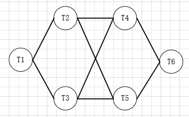
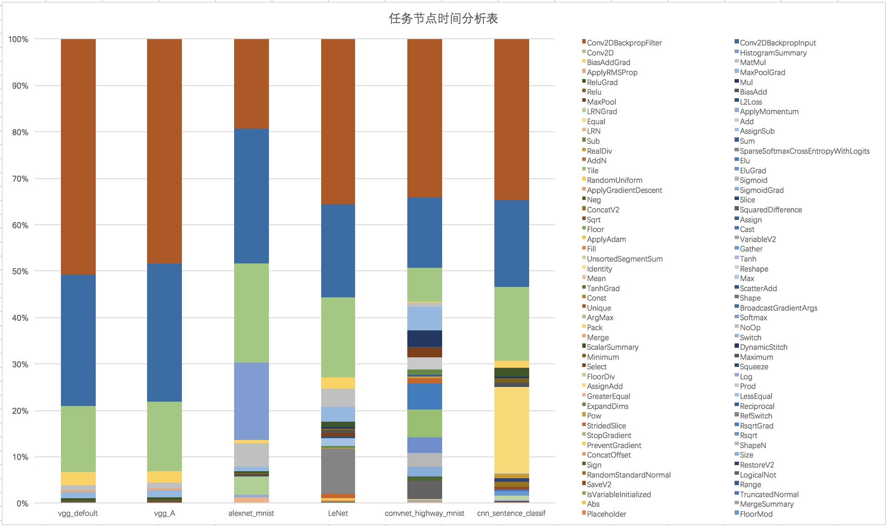
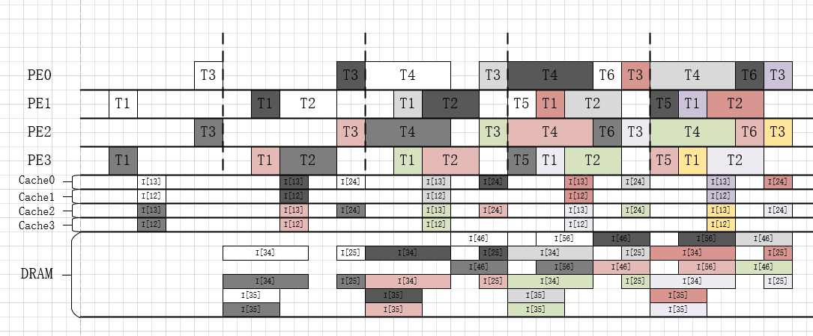
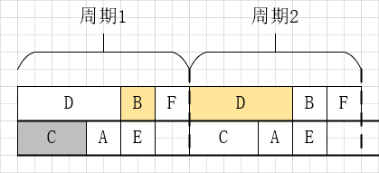
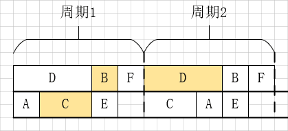

# 背景

##TensorFlow

TensorFlow是现在最流行的一个机器学习框架之一，它使用数据流图来描述数学计算。在数据流图中，节点一般表示数学运算，也可以表示数据输入的起点或输出的终点；边表示在这些节点之间传递的张量。

## CNN

## 硬件架构

随着计算效率在由神经驱动的学习系统（neuro-inspired learning systems）中被施以强烈的关注，基于神经形态（neuromorphic）的高级加速架构越来越多，其中最经典的就是基于HMC的Neurocube。HMC由多个堆叠在一起的DRAM Die和一个单独的逻辑层组成。如图左侧，每个DRAM Die被划分成16份子块，从垂直方向看对应的子块构成一个Vault，每个Vault在逻辑层上对应一个Vault控制器。Neurocube在HMC的基础上对逻辑层进行了改变，将Vault控制器、可编程的神经序列生成器（PNG）、路由器（Router）、执行单元（PE）组合在一起，构成新的逻辑层。如图右侧，路由器通过2D全连接NoC网络连接在一起；每个执行单元内包括了一个Cache、一个权值Buffer、一个缓冲Buffer、一个操作计数器和多个乘法累加器。

数据可以被存储Vault（DRAM）和Cache之 中。DRAM能够存储的数据远大于Cache，但读取的速度却慢了很多，所以**在存储数据的时候需要判断是存储在Vault之中还是存储在Cache之中**。PNG负责控制数据的流动，当计算开始时，PNG根据当前神经元所需要的数据去对应的存储位置取到数据，然后封装成对应的数据包，通过NoC网络传送给对应的PE进行计算。当PE中MAC计算完成后，将计算完成的结果传回给PNG，PNG判断后继需要这个数据的神经元，将其存储到对应PE的Cache之中，若Cache存储不下，则存储到对应的vault中。

# 建模

在TensorFlow中，神经网络可以通过TensorBoard来展现数据的流动状况，如下图。TensorBoard 通过读取 TensorFlow 的事件文件来运行。TensorFlow 的事件文件包括了在 TensorFlow 运行中涉及到的运算操作。

如果我们把TensorBoard的图中最小的框（直接与数据边相连的）作为节点，把数据流动作为边，再去除一些无关紧要的节点后，我们就可以把这个数据流图抽象建模成一个有向无环图。

# 动机

CNN的高准确率和适用性促进了许多AI应用的诞生，如DeepFace，Prisma（<u>*参考的李涛教授的论文*</u>）。它们在实际应用中十分广泛，也得到了人们的广泛亲睐。这些AI应用都是基于已经训练好的CNN模型，直接对未知的新样本进行预测。越来越多的人使用AI应用，这对它们的实际预测性能提出了很高的要求：耗时短、准确率高等。在某一个较短的时间内，提供AI服务的服务端需要同时对大量的新样本进行预测，若预测的速度不够快将会增加用户的等待时长。本文基于此提出一个合理的调度算法，能够根据现有的资源给出一个调度方案，在一个可接受的时间范围内，让总体的时间降低，提高单位时间内的现有资源的利用率。

以上面的有向无环图为例，以下展示了一种在4个PE上的调度策略。

这种调度策略使用了2次发射，每次发射上，每隔9个单位时间为一个周期。

通过对从TensorFlow得到的有向无环图的数据进行分析，可以得到以下分析图。

从数据分析图中可以看出，其中有3类节点的运行时间都普遍较长：Conv2DBackproFilter类的节点在vgg图中平均占据了约50%的运行时间，在LeNet、convnet和cnn等图中平均占据了约35%的运行时间，在alexnet中也占据了约20%的运行时间；Conv2DBackpropInput类的节点在vgg、alexnet等图中平均占据了约30%的运行时间，在LeNet、convnet和cnn等图中平均占据了约15%的运行时间；Conv2D类的节点在每个图平均占据了10%-15%的运行时间。同时，在alexnet图中的HistogramSummary类的节点、LeNet图中的SparseSoftmaxCrossEntropyWithLogits类节点和CNN图中的Equal类的节点也都平均占据了各自的约10%-15%的运行时间。

我们把这些时间运行长的节点称为关键节点，并针对这些关键节点专门设计了新的调度策略。

这种新的调度策略同样采用了多发射的技术，以2个PE为一次发射。每次发射也由一个个周期组成，每个周期需要5个单位时间，在调度中仅仅消耗了2个周期作为前序。这种新的调度策略相比于前者，更为紧凑，PE的利用率更高，相同的时间内执行的CNN图的次数更多。

不同任务之间的数据并不是一产生就可以直接被拿来利用计算的，往往或大多数时间都需要先存在SRAM或DRAM中，再从它们中取出来计算。我们都知道SRAM读写速度快，但容量小，DRAM速度慢，但容量大。所以在这里就存在一个选择的问题，对CNN中的每个中间结果数据都需要考虑是否放在SRAM中还是DRAM中。

# 算法

## 输入

**定义：**有向无环图DAG，$G=(V,E,P,R)$，其中$V$表示节点集合，$V=\{T_1, \ldots, T_n\}$；$E$表示边集合，$，E\subseteq V\times V$，$(T_i, T_j)\in E$，其中$T_i,T_j\in V$，边个数是$m$；$N_{PE}$表示PE个数；$R$表示图$G$的重定时次数。其中$T^l_i(s^l_i, c^l_i, d^l_i, e^l_i,tp^l_i)$表示第$l$次循环的第$i$个节点的开始时间$s^l_i$，执行时间$c^l_i$，结束时间$d^l_i$，所在PE$e^l_i$，拓扑序$tp^l_i$。$I^l_{i,j}(s^l_{i,j}, c^l_{i,j}, d^l_{i,j})$表示第$l$次循环节点$T_i$到$T_j$的边的开始时间$s^l_{i,j}$，内存消耗$c^l_{i,j}$，结束时间$d^l_{i,j}$。

**定义：**$X$表示图$G$需要循环的次数。

## 输出

* 图$G$循环$X$次所需要的总时间$C$ 

## 流程

## 细节

**定义1（周期Period）：**图$G$中节点集合$V$重复一定次数并行的在一定数量的PE上执行的过程。

**定义2（发射Launch）：**多个在相同的PE上的周期组成的集合。

**定义3（周期利用率$U_L$）：**$U_{L}=\displaystyle\frac{X_{p}\times \displaystyle\sum_{V_{i}\in V}c_{i}}{h\times t_L}$，其中$t_L$表示周期的最大时间消耗，$c_{i}$表示任务节点$T_{i}$的执行时间。

**定义4（重定时Retiming）：**对图$G=(V,E,P,R)$，重定时$R$是将节点$T_i$与一个非负整数$R(i)$映射起来，初始$R(i)=0$。一旦节点$T_i$需要进行一次重定时，则$R(i)=R(i)+1$，同时一个周期的操作$T_i$被重新分配到前序之中。

### 1. 计算每次发射的PE数$h$、图的执行次数$p_L$

因为采用了多发射技术，所以可以图$G$总的需要的循环次数均摊到每次发射之上，以达到更高效的并行性。同时每次发射所需要的PE的数量不同，对最后的结果也会有所影响。设$h$为每次发射时需要的PE数，那么$h$应该尽可能的接近图$G$的最大并发度，总共需要的发射次数$H=\lceil N_{PE}/h\rceil$。

> 设图的最大并发度为$h_{G}$。
>
> 若$N_{PE}\% h_G==0$，
>
> * $h=h_G$
> * $X_{L}=\lceil I/H\rceil$
>
> 若$N_{PE}\%h_G\neq0$，
>
> * $\begin{cases}h=h_G&Previous\;H-1\;Launchs\\h=N_{PE}\%h_G&Last\;one\;Launch\end{cases}$
> * 若设前$H-1$次发射每次循环$X_{x}$次，最后一次发射循环$X_{y}$次。故$(X_{x},X_{y})$需要满足$X=(H-1)\times X_{x}+X_{y}$。对所有满足的$(X_{x}, X_{y})$选取使总时间$T$最小的一组$(X_{x},X_{y})$。

### 2. 生成周期的任务排列

对于一个包含$h$个PE的周期，不同的任务排列对最终的结果有着很大的影响。若直接按照顺序把所有任务节点依次排列在4个PE上，可以一个周期的时长是8个单位时间，利用率是84.4%。通过观察可以发现，因为图G中有一个长节点$T_4$，它的运行时间远大于其他的运行节点，它对周期的时长和利用率起到了决定性作用。

为了避免分配的不均衡，本算法考虑这些长执行时间的任务节点所带来的影响，采取贪心的策略对任务节点进行排列。这个问题可以抽象成最小化最大值问题，即最小化PE上所有任务时间之和的最大值。算法的思想是对所有的节点按照执行时间大小从大到小排序，每次将枚举的节点放在当前所有PE中总时间最小的PE上。

$X_{p}$的值依据$U_{p}$来确定。每按照上述算法排列一次图$G$，$X_{p}\leftarrow X_{p}+1$，并重新计算一下当前的利用率$U_p$，若$U_p\ge U_{limited}$，则停止排列；若$X_{p}\ge X_{limited}$，则停止排列，选择之前计算得到的最大的$U_{p}$。

> **Input**
>
> $A\;set\;tasks\;\{T_1,\ldots,T_n\}\in V$
>
> $N_{PE}\;homogeneous\;PEs$
>
> $h\;of\;tasks\;that\;are\;concureently\;execeuted\;within\;same\;layer$
>
> $the\;threshold\;PE's\;utilization\;ratio\;U_{limited}$
>
> $the\;max\;repeat\;times\;X_{limited}\;of\;tasks\;in\;same\;iteration$
>
> **Output**
>
> $An\;initial\;schedule\;with\;X_{p}\;repeat\;times\;tasks$
>
> **Content**
>
> $InitArrange()$
>
> $Sort(V) \;first\; by \;c_i\;,second\; by\; tp_{i}$
>
> $While\; U_{p}\lt U_{limited}\;and\;X_{p}\lt X_{limited}:$
>
> $\quad For\;each \;task\;T_j\in V:$
>
> $\quad\quad Assign\;T_j\;to \;a\;PE\;in\;PIM\;with\;the\;earliest\;available\;time$
>
> $\quad X_{p}\leftarrow X_{p}+1$
>
> $\quad Re-Calculate\;U_p$
>
> $If\;X_{p}==X_{limited}:$
>
> $\quad Choose\;X_{p}\;with\;max\;U_{p}$
>
> $Rearrange\;X_{p}\;times\;tasks\;with\;same\;strategy$

时间复杂度：$O(X_{p}\times n\times log\;h)$

### 3. 判断是否需要采取进行重定时策略

设$C_{b}$是按照BaseLine的调度策略所需要花费的总时间、$C_{e}$是利用重定时技术的估计时间。

若$C_{b}\gt C_{e}$，则按照BaseLine的调度策略。

计算$C_{e}$：在步骤二中，设置$p_{limited}\leftarrow1$，$h\leftarrow N_{PE}$，得出一个周期的排列。计算得出前序时间$C_{prelogue}$和周期时间$C_{p}$。则$C_{e}\leftarrow C_{prelogue}+X\times C_{p}$

### 4. 确定周期内每个任务节点的最终位置

在步骤二中，我们生成了每个周期的初始排列，但是在生成这个排列的时候没有考虑任务之间的依赖关系，仅仅是考虑到每个任务的时间长短。那么在后续的调度时，通过调整初始排列中的任务节点的位置，以更好的满足任务之间的依赖关系。

为了方便调整位置，我们首先确定一个顺序来依次调整任务节点的位置，先确定了位置的任务节点将不再会移动位置。根据之前对任务节点耗时的分析，关键节点在位置排列的时候会对其他节点的重定时值产生较大的影响。（<u>*是否需要举例说明*</u>）故本文的策略是从关键节点开始，按照拓扑序从后往前开始扩散。每次扩散时都标记已访问的节点，当扩散完成后，再从未访问的节点中选择新的关键节点继续开始扩散，直到所有节点都被访问过一次。

以下面这个例子来解释扩散的过程。

图（a）中选择了关键节点$T_4$作为扩散的起始节点。从图（a）到图（c）展示了第一次的扩散过程。图（d）从未访问过的节点$T_5,T_6$中重新选择了关键节点$T_6$作为新的扩散起始节点。图（e）从$T_6$扩散至$T_5,T_4$，因为$T_4$已经被访问过，所以只需要它的位置不需要再进行改变。若$T_4$和$T_6$的位置之间的距离不满足边$I_{4,6}$的所需要的时间消耗的长度，则需要对$T_4$做重定时操作。当$R(4)$的值发生改变后，与其相连的前继节点对应的$R(i)$也需要更新。为了避免重复更新，在$R(4)$更新后，仅仅标记$T_4$节点，等待所有的节点都访问完成后，再从拓扑序最大的标记节点开始向前更新。

对边$I_{3,4}$，若$T_2, T_4$的位置已经固定，下面解释如何确定$T_3$的位置，如下图，

因为$I_{3,4}$在SRAM中需要消耗2个单位时间，所以同一个周期内的$T_3$节点不满足要求，只能先看前一个周期的$T_3$节点。周期1的$T_3$与周期2的$T_4$节点之间相差3个单位时间，所以我们可以通过移动$T_1$或$T_5$的位置，是$T_3$与$T_4$之间刚好相差2个单位之间，得到如下的排列。

接下来再用同样的策略去确定其他的节点位置，直到所有的节点位置均已确定。

>**Input**
>
>$A\;set\;of\;n\;tasks\;\{T_1, \ldots,T_n\}\in V$
>
>**Output**
>
>$A\;schedule\;after\;adjusting$
>
>**Content**
>
>$SpreadFromKeyNodeSet():$
>
>$Q\leftarrow \emptyset$
>
>$do\; \{$
>
>$\quad Get\;keynode\;set\;V_{keynode}\;from\;V_{unchecked}$
>
>$\quad For\;each\;task\;T^l_i\in V_{keynode}:$
>
>$\quad\quad Put\;T^l_iin\;nearest\;position,update\;s^l_i\;and\;d^l_i$
>
>$\quad \quad ENQUEUE(Q, T^l_i) $
>
>$\quad While\; Q\neq \emptyset:$
>
>$\quad \quad T^l_i\leftarrow DEQUEUE(Q)$
>
>$\quad\quad For\;each\;edge\;I^l_{ji}\in E$
>
>$\quad\quad\quad Put\;T^l_j\;in\;nearest\;position,update\;s^l_j\;and\;d^l_j$
>
>$\quad\quad\quad ENQUEUE(T^l_j)$
>
>$\}\;While(V_{unchecked}\neq \emptyset);$

时间复杂度：$O(X_{p}\times m )$

### 5. 利用动态规划来分配任务的中间传输的数据存储位置

考虑到SRAM的容量有限，我们无法将所有的中间结果都存储在SRAM中，必定有一部分的中间结果需要存储到DRAM中。而选哪些中间结果存储到DRAM中，这可以被抽象成一个动态规划问题。

假设有$m$个中间结果，即$\{I_1,\ldots,I_k,\ldots,I_m\}$。设$\mathbb B[S][k]$表示前$k$个中间结果，在容量为$S$的SRAM中能存储的最大容量。那么可以得到状态转移方程。
$$
\mathbb B[S][k]=
\begin{cases}
\mathbb B[S][k-1]&if\;I_k\gt S
\\
max\{\mathbb B[S][k-1],\mathbb B[S-I_k][k-1]+I_k\} & if \;I_k\le S
\end{cases}
$$
当计算完$\mathbb B[S][m]$后，通过回溯法得到最优解。对放入DRAM的中间结果，与扩散方法类似的更新其所连接的节点的重定时值，最终计算出总共需要的时间。

